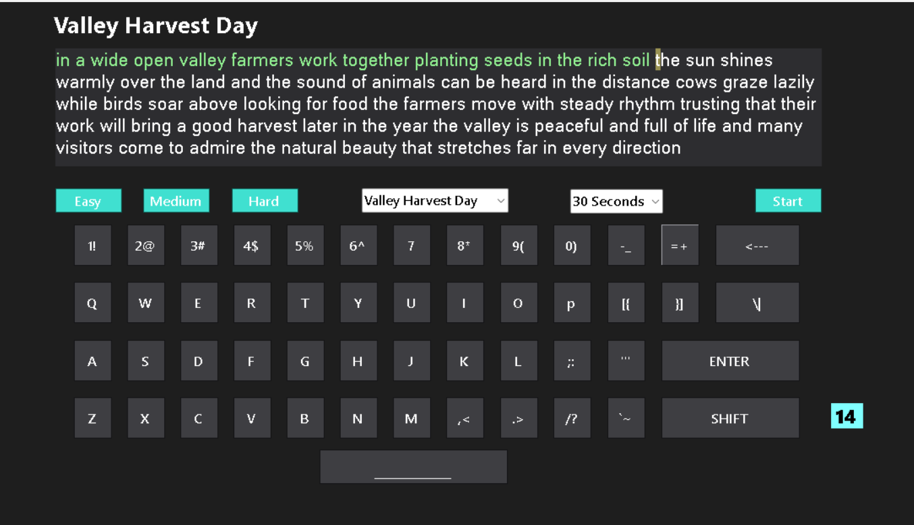

<h1>🚀 SharpType</h1>
<h3>The Modern, High-Performance Typing Trainer</h3>

A lightweight, dark-themed typing engine built from scratch in C# Windows Forms.
 
<b>No External Libraries. Pure Logic.</b>

<!-- Badges -->

 

<!-- SCREENSHOT PLACEHOLDER -->

<!-- 📸 Take a screenshot of your app, save it as 'screenshot.png', and it will appear here -->

 

📖 About The Project

SharpType is not just another text box. It is a fully custom-engineered typing environment designed to improve muscle memory and typing speed.

Unlike standard forms that rely on basic input, SharpType intercepts the Windows Message Loop to provide a seamless, game-like experience. It features a custom rendering engine that handles real-time validation, cursor tracking, and mechanical sound feedback with zero latency.

✨ Key Features

🎮 Immersive Experience

Visual Keyboard: On-screen keys glow dynamically (KeyDown/KeyUp) to reinforce muscle memory without looking at your hands.

Mechanical Audio: Crisp, low-latency sound effects on every keystroke using System.Media.

Smart Cursor: An orange highlight guide that leads your eyes to the next target character.

⚡ Performance & Modes

Sprint Modes: Test your speed in 15s, 30s, or 60s bursts.

3 Difficulty Tiers: Curated texts ranging from simple village stories to complex scientific articles.

Instant Feedback: - <b>Green</b> for correct hits.

<b>Red</b> for mistakes (Stop-on-Error logic).

📊 Real-Time Analytics

WPM Calculator: Precise "Words Per Minute" algorithm accounting for standard 5-character word lengths.

Accuracy Engine: Tracks every error relative to total keystrokes for a fair percentage score.

🛠️ Under the Hood (Technical Engineering)

This project was built to demonstrate Data Structures and Clean Architecture over simple drag-and-drop coding.

1. Dictionary Mapping (O(1) Performance)

Instead of writing 26+ if-else statements to check which key was pressed, I implemented a Dictionary to map physical keys to visual controls instantly.

// The Engine Core: Mapping Hardware Keys to UI Buttons
Dictionary<Keys, Button> keyMap = new Dictionary<Keys, Button>();

// O(1) Lookup Speed - No iterating through lists
if (keyMap.ContainsKey(e.KeyCode)) 
{
    keyMap[e.KeyCode].BackColor = Color.Turquoise; // Instant Glow
}

2. Advanced Event Handling

The app intercepts the Operating System's input stream to separate "Game Logic" from "Text Input".

KeyDown: Triggers the visual glow and sound (Physically reactive).

KeyPress: Handles the game logic, scoring, and text validation (Logically reactive).

e.Handled = true: Prevents the OS from printing text to the screen, allowing the custom engine to render colored text manually.

3. Modular Architecture

The codebase follows a clean separation of concerns:

ResetGame(): Handles state management.

CalculateResults(): Pure logic functions for math.

ResetVisuals(): UI-specific cleanup.

<i>"Code is like humor. When you have to explain it, it’s bad." – Cory House</i>

